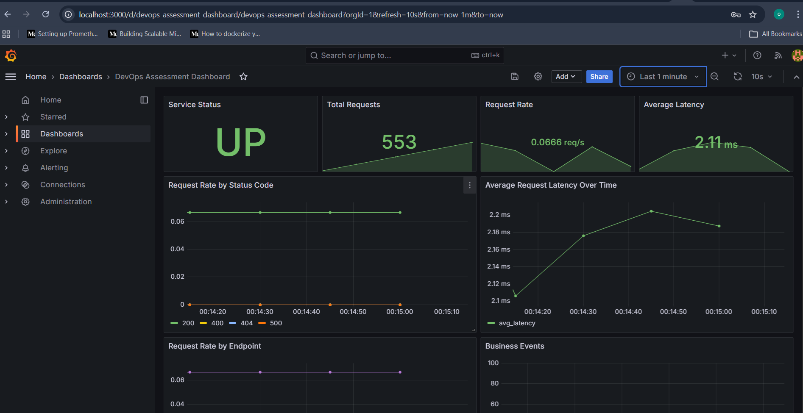
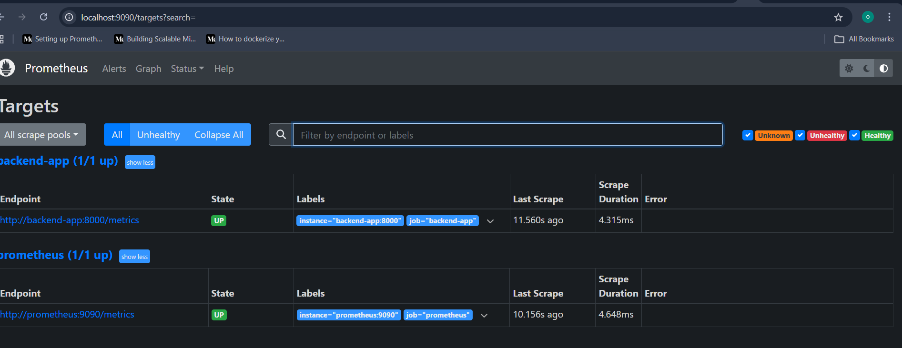
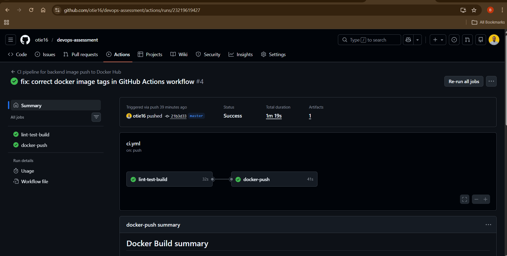
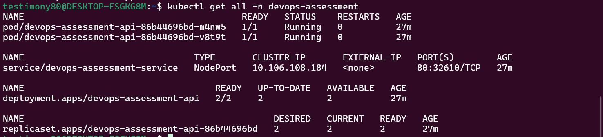
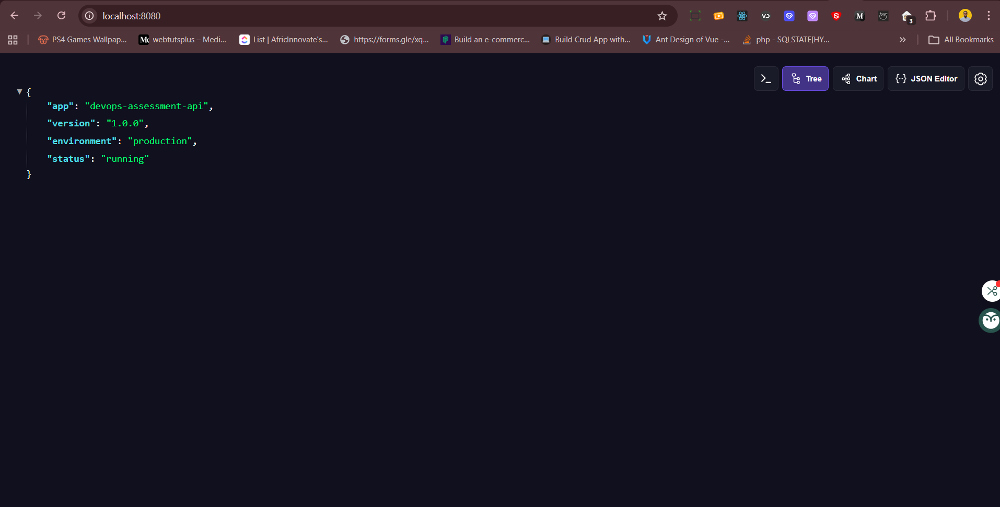

# 🚀 DevOps Assessment Solution

## 📌 Overview

This project is a **production-minded DevOps assessment solution** built around a Python FastAPI service.

It demonstrates not just how to run an application, but how to make it:

- observable 📊  
- testable 🧪  
- reproducible 🔁  
- deployment-ready ☸️  

---

## ✨ Features

- ⚡ FastAPI-based Python API  
- ❤️ Health and readiness endpoints  
- 📊 Prometheus metrics integration  
- 🧾 Structured logging  
- 🐳 Dockerized application  
- 📈 Local observability with Prometheus & Grafana  
- 🔁 GitHub Actions CI pipeline  
- 📦 Docker Hub image publishing  
- ☸️ Kubernetes deployment (Minikube)  
- 🧹 Linting & formatting (Ruff + Black)  
- 🧪 Unit testing with Pytest  

---

## 🧰 Tech Stack

- 🐍 Python 3.12  
- ⚡ FastAPI  
- 🚀 Uvicorn  
- 📊 Prometheus  
- 📈 Grafana  
- 🐳 Docker  
- 🧩 Docker Compose  
- 🔁 GitHub Actions  
- 📦 Docker Hub  
- ☸️ Kubernetes (Minikube)  
- 🧹 Ruff & Black  
- 🧪 Pytest  

---

## 🌐 API Endpoints

| Endpoint | Description |
|--------|------------|
| `/` | App info |
| `/health` | Liveness check |
| `/ready` | Readiness check |
| `/info` | Runtime info |
| `/metrics` | Prometheus metrics |
| `/api/v1/sample` | Sample endpoint |
| `/api/v1/error` | Simulated 400 error |
| `/api/v1/crash` | Simulated 500 error |

---

## 📁 Project Structure

```text
devops-assessment/
├── app/
├── tests/
├── monitoring/
├── k8s/
├── .github/workflows/
├── Dockerfile
├── docker-compose.yml
├── requirements.txt
├── requirements-dev.txt
└── README.md
````

---

## 💻 Local Development

### 🔧 Setup environment

```bash
python -m venv .venv
source .venv/bin/activate   # Linux/macOS
.venv\Scripts\Activate.ps1  # Windows
```

### 📦 Install dependencies

```bash
pip install -r requirements-dev.txt
```

### ▶️ Run the app

```bash
uvicorn app.main:app --host 0.0.0.0 --port 8000 --reload
```

### 🧪 Test endpoints

```bash
curl http://localhost:8000/
curl http://localhost:8000/health
curl http://localhost:8000/ready
curl http://localhost:8000/info
curl http://localhost:8000/api/v1/sample
curl http://localhost:8000/api/v1/error
curl http://localhost:8000/api/v1/crash
curl http://localhost:8000/metrics

```

---

## 🧪 Code Quality & Testing

### Tools used

* 🧹 Ruff (linting)
* 🎨 Black (formatting)
* 🧪 Pytest (testing)

### Run checks

```bash
ruff check .
black --check .
pytest
```

### Auto-format

```bash
black .
```

---

## 🐳 Docker

### 🔨 Build image

```bash
docker build -t <your-username>/devops-assessment-api:local .
```

### ▶️ Run container

```bash
docker run -p 8000:8000 <your-username>/devops-assessment-api:local
```

---

## 📊 Observability (Prometheus + Grafana)

### ▶️ Start stack

```bash
docker compose up --build -d
```

### 🌐 Access

* App → [http://localhost:8000](http://localhost:8000)
* Prometheus → [http://localhost:9090](http://localhost:9090)
* Grafana → [http://localhost:3000](http://localhost:3000)

### 🔐 Grafana login

* Username: `admin`
* Password: `admin`

---

## 🔁 CI Pipeline (GitHub Actions)

### ✅ Pipeline includes:

* 📦 Dependency install
* 🧹 Linting (Ruff)
* 🎨 Formatting check (Black)
* 🧪 Unit tests
* 🐳 Docker build
* 📦 Docker Hub push

### 🔐 Required secrets

* `DOCKERHUB_USERNAME`
* `DOCKERHUB_TOKEN`

---

## 📦 Docker Hub Images

```text
otobongedoho18361/devops-assessment-api:latest
otobongedoho18361/devops-assessment-api:<commit-sha>
```

---

## ☸️ Kubernetes (Minikube)

### 🚀 Deploy

```bash
minikube start --driver=docker
kubectl apply -k k8s/
```

### 🔍 Verify

```bash
kubectl get all -n devops-assessment
```

### 🌐 Access app

```bash
kubectl port-forward -n devops-assessment svc/devops-assessment-service 8080:80
```

Then open:

```
http://localhost:8080
```

---

## 🧠 Architecture Summary

```
User → FastAPI → Prometheus → Grafana
        ↓
      Docker
        ↓
    Kubernetes
```

---

## Monitoring Approach

For this assessment, observability was implemented locally using Docker Compose with Prometheus and Grafana.

This demonstrates:

* metrics exposure from the application
* Prometheus scraping
* dashboard visualization in Grafana

A future extension would be to deploy Prometheus and Grafana inside Kubernetes or integrate with Kubernetes-native monitoring components.

---

## Key Engineering Decisions

### FastAPI

FastAPI was chosen for its simplicity, clarity, and strong support for modern Python APIs.

### Uvicorn

A single Uvicorn process was used in the container to keep the runtime simple and Kubernetes-friendly. Horizontal scaling is better handled at the orchestration layer through replicas rather than by increasing worker count inside the container for this assessment.

### Separate runtime and development dependencies

`requirements.txt` contains only runtime dependencies, while `requirements-dev.txt` includes linting, formatting, and testing tools used in development and CI.

### Non-root Docker container

The application runs as a non-root user inside the container to align with safer container practices.

### Readiness and liveness probes

Separate readiness and health endpoints were used so Kubernetes can make better lifecycle decisions.

## ⚙️ Key Decisions

* ⚡ FastAPI for simplicity and performance
* 🐳 Docker for portability
* ☸️ Kubernetes for orchestration
* 📊 Prometheus + Grafana for observability
* 🔁 CI for automation and quality

---

## ⚖️ Trade-offs

* Monitoring deployed locally instead of in-cluster
* Alertmanager not included (optional scope)
* No HPA due to Minikube constraints

## 🧠 How I approached this solution

This project was approached with a focus on production readiness rather than just functionality.

Key priorities were:

- Observability: ensuring metrics are exposed, scraped, and visualized
- Automation: enforcing code quality and build steps through CI
- Reproducibility: making the system easy to run locally and in Kubernetes
- Simplicity: avoiding unnecessary complexity while covering all required components

The solution was built incrementally:

1. Application with metrics and structured logging
2. Containerization with Docker
3. Observability stack with Prometheus and Grafana
4. CI pipeline with linting, testing, and image build/push
5. Kubernetes deployment with probes and configuration separation

Trade-offs were made intentionally to keep the solution focused and aligned with the assessment scope.

---
## 📸 Screenshots

### 📊 Grafana Dashboard

Shows request rate, latency, and service health.



---

### 📈 Prometheus Targets


---

### 🔁 CI Pipeline (GitHub Actions)


---

### ☸️ Kubernetes Pods


---

### 🌐 Application Running


## 🔮 Future Improvements

* 📊 In-cluster monitoring (Prometheus Operator)
* 🚨 Alertmanager integration
* 🌐 Ingress setup
* 📦 Helm charts
* 🔐 Security scanning in CI and CD to deploy to Kubernetes cluster
* 🔍 Distributed tracing

---

## 🏁 Conclusion

This solution demonstrates a **complete DevOps workflow**, including:

* application development
* observability
* CI/CD
* containerization
* Kubernetes deployment

The focus was on **clarity, reproducibility, and production readiness**.

